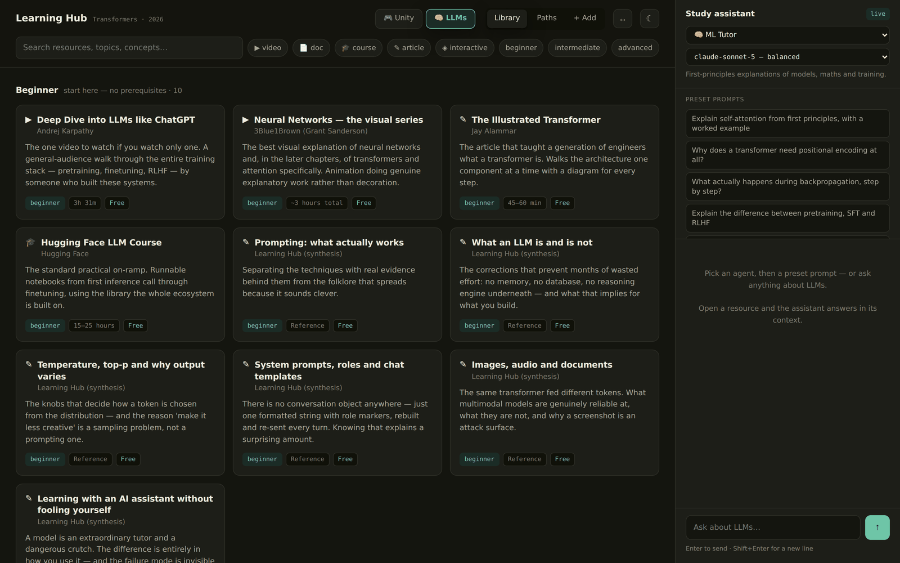
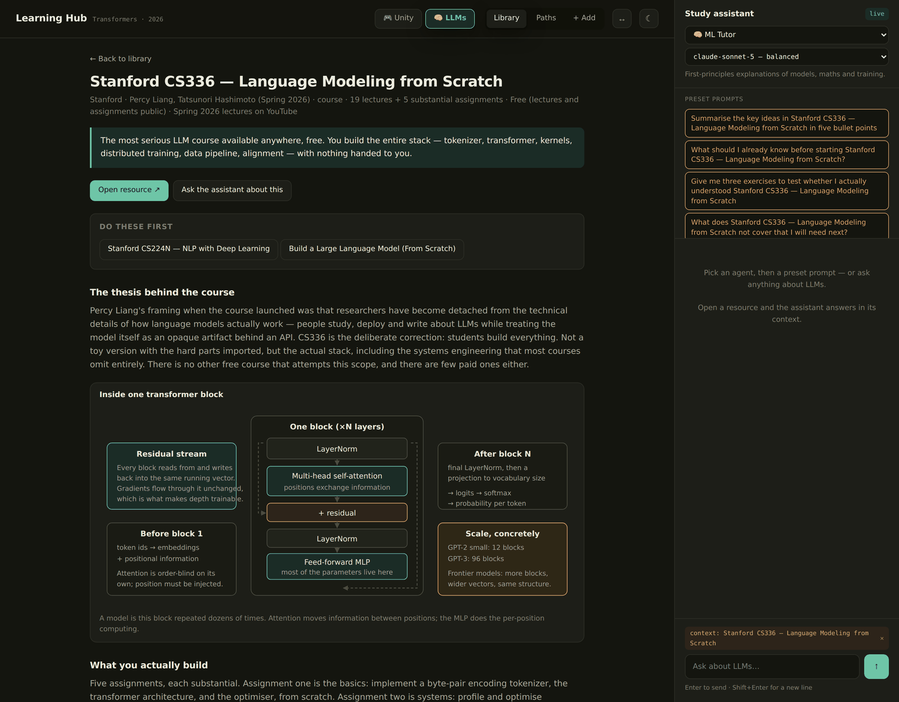
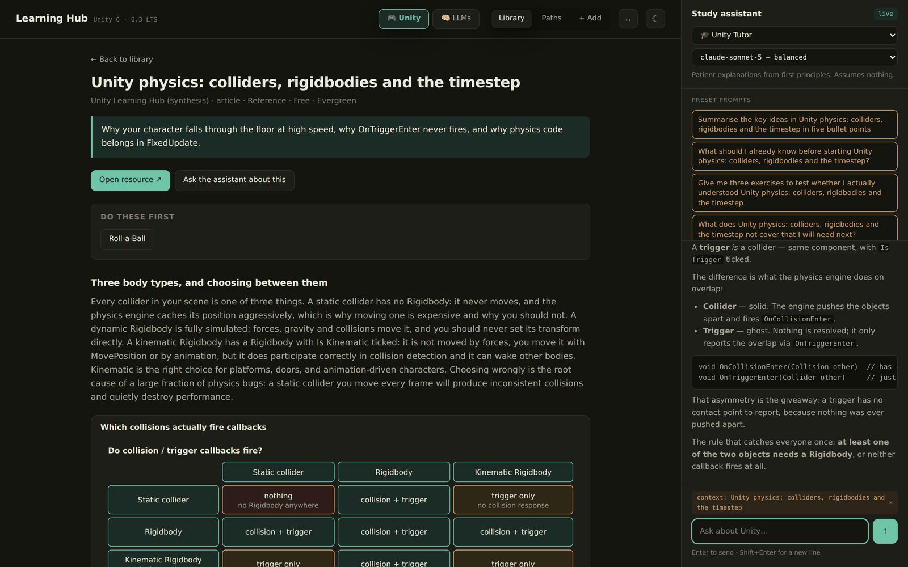
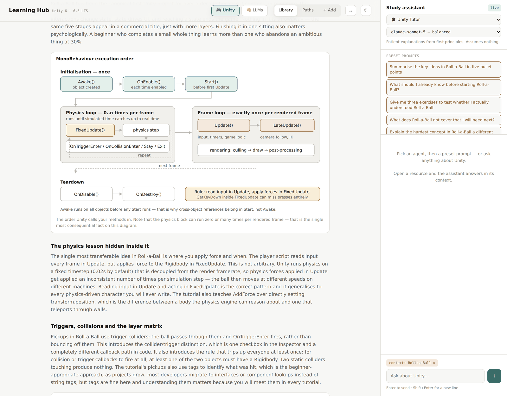
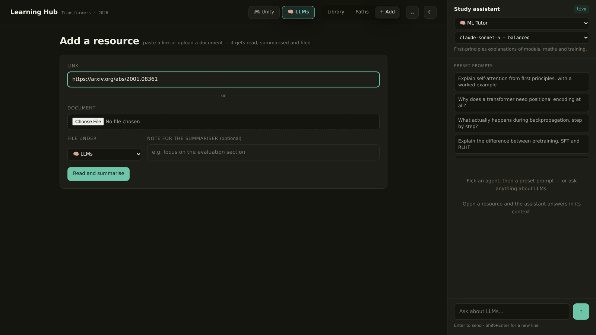
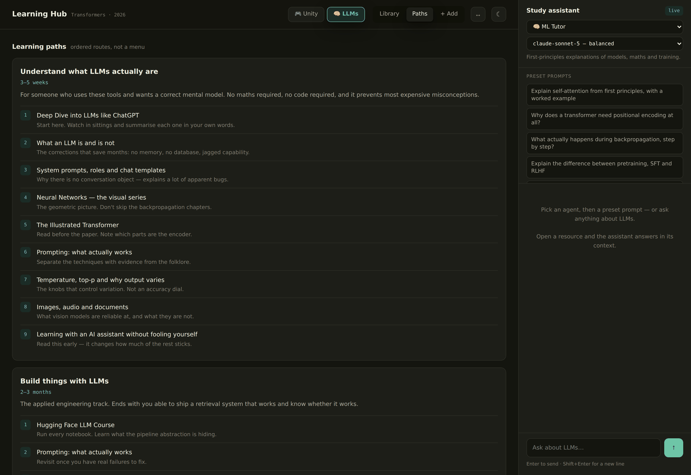
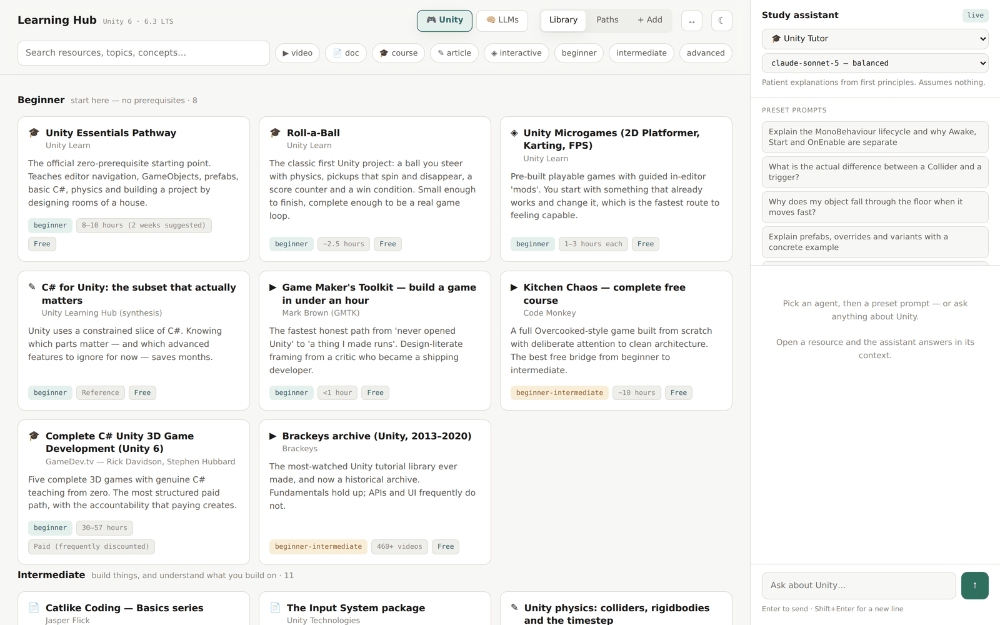
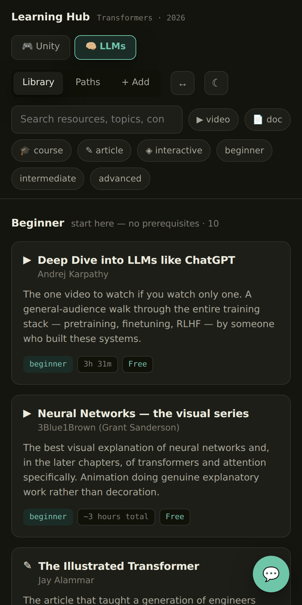

# Learning Hub

A self-hosted learning site for **Unity game development** and **LLMs / machine learning**.

56 curated resources with long-form original summaries, 56 hand-drawn concept diagrams,
8 ordered learning paths, a study assistant with 14 Claude agent personas, and a one-click
way to add your own links and documents — which get read, summarised and filed automatically.

Runs on localhost. No build step, no framework, no dependencies — Python standard library only.



---

## Contents

- [Run it](#run-it)
- [Turn on the assistant](#turn-on-the-assistant)
- [What's in it](#whats-in-it)
- [Screenshots](#screenshots)
- [Project layout](#project-layout)
- [Adding your own resources](#adding-your-own-resources)
- [Accuracy](#accuracy)

---

## Run it

```bash
python3 server.py
```

Open **http://localhost:8000**.

```bash
python3 server.py --port 8080   # different port
```

Python 3.8+ is the only requirement.

---

## Turn on the assistant

The library, summaries, diagrams and paths all work with no configuration. The chat panel and
the **+ Add** feature need a Claude API key from [console.anthropic.com](https://console.anthropic.com).

**macOS / Linux**

```bash
export ANTHROPIC_API_KEY=sk-ant-...
python3 server.py
```

**Windows (cmd)**

```cmd
set ANTHROPIC_API_KEY=sk-ant-...
python server.py
```

> On Windows `cmd`, do **not** quote the key — `set` treats quotes as part of the value.
> PowerShell uses `$env:ANTHROPIC_API_KEY="sk-ant-..."` and *does* want them.

The banner prints `API key  yes` when it's found, and the badge in the assistant header reads
**live**. The key stays on the server — the browser never sees it, and every request is proxied
through `/api/chat`.

---

## What's in it

Two subjects, switched with the **Unity / LLMs** tabs. Each has its own library, learning paths
and set of assistant agents.

### Library

56 resources (22 Unity, 34 LLM) grouped into Beginner, Intermediate and Advanced, filterable by
type and level, searchable across titles, tags, concepts and section headings.

Each resource opens to a written explainer of 400–1,400 words — what it actually teaches, the
mental model it installs, what transfers and what doesn't — plus a concept glossary, concrete
takeaways, and the specific pitfalls it helps you avoid. Diagrams are interleaved with the prose.

### The LLM track

Stanford courses are prioritised, and all are free with public lecture video:

| Course | Level | Covers |
|---|---|---|
| [CS336 — Language Modeling from Scratch](https://stanford-cs336.github.io/spring2025/) | Advanced | Build the whole stack: tokenizer, transformer, Triton kernels, distributed training, data pipeline, alignment |
| [CS224N — NLP with Deep Learning](https://web.stanford.edu/class/cs224n/) | Intermediate | Word vectors → transformers → pretraining, RAG, agents, reasoning |
| [CS25 — Transformers United](https://web.stanford.edu/class/cs25/) | Advanced | Seminar series; researchers presenting current work |
| [CS229 — Machine Learning](https://cs229.stanford.edu/) | Advanced | Mathematical foundations that make papers readable |

Alongside these: Karpathy's *Deep Dive into LLMs* and *Zero to Hero*, 3Blue1Brown's visual series,
the Illustrated Transformer, the Hugging Face LLM course, Raschka's *Build an LLM from Scratch*,
MIT 6.S191, fast.ai, and the original Attention paper.

Plus original written references, 5–7 sections each:

- **Beginner** — what an LLM is and is not · prompting that works · sampling and temperature ·
  system prompts and chat templates · images, audio and documents · learning with an AI assistant
  without fooling yourself
- **Intermediate** — RAG · structured output and tool calling · embeddings and vector search ·
  evaluation · finetuning · cost modelling · security and prompt injection
- **Advanced** — post-training (RLHF/DPO/RLVR) · reasoning models and test-time compute · mixture
  of experts · distributed training · inference and serving · distillation · agents · interpretability

### The Unity track

The official pathways and Roll-a-Ball, Code Monkey's Kitchen Chaos, Catlike Coding, Sebastian
Lague, GameDev.tv, the Brackeys archive (clearly marked as frozen since 2020), plus written
references on the MonoBehaviour lifecycle, physics, the Input System, render pipelines, UI
systems, profiling, multiplayer and the shipping phase most tutorials skip.

### Diagrams

56 original theme-aware SVGs, shown inline in the resource pages they belong to — the
MonoBehaviour lifecycle, the fixed-timestep accumulator, the collision matrix, render pipelines,
frame budget, network authority, the transformer block, self-attention, tokenization, the training
pipeline, RAG, KV cache and decode, mixture of experts, prompt injection paths, and more.

### Assistant

14 agents, filtered to the active subject, each with its own system prompt, default model and
preset prompts. Model is selectable per message (Opus 5 / Sonnet 5 / Haiku 4.5).

| Unity | LLM |
|---|---|
| Unity Tutor | ML Tutor |
| Code Reviewer | Paper Explainer |
| Debug Detective | Prompt Engineer |
| Project Architect | RAG Architect |
| Graphics & Shaders | Training Advisor |
| Performance Engineer | Production Engineer |
| Multiplayer Specialist | |
| Build & Ship Advisor | |

Open a resource and its concepts, takeaways and pitfalls are passed to the agent as context,
with five context-specific presets at the top of the list.

### + Add

Paste a link or upload a document and press submit. The server fetches or reads it, sends the
text to Claude, and writes a full library entry — a 5–7 section summary, key concepts, takeaways
and pitfalls, in the same shape as every built-in resource. It's filed under whichever subject you
pick, tagged **yours**, and saved to `data/custom-resources.json` so it survives restarts.

Accepts any http(s) page plus `.pdf`, `.docx`, `.txt`, `.md`, `.html` and plain source files, up
to 12 MB. PDFs need `pip install pypdf`; everything else needs nothing.

---

## Screenshots

**Resource detail — summary, diagrams, key concepts, prerequisites**



**Study assistant answering in the context of the open resource**



**Concept diagrams, inline and theme-aware**



**Add your own link or document**



**Learning paths — ordered routes with a note on every step**



**Light theme**



**Responsive**



---

## Project layout

```
learning-hub/
├── server.py                 static server + Claude proxy + ingest
├── index.html
├── styles.css                theming, all colour tokens
├── app.js                    routing, rendering, chat, ingest UI
├── docs/screenshots/
└── data/
    ├── resources-1.js        Unity: foundations & editor
    ├── resources-2.js        Unity: scripting, physics, input, architecture
    ├── resources-3.js        Unity: graphics, UI, performance, shipping
    ├── diagrams.js           Unity diagrams
    ├── agents.js             Unity agents + preset prompts
    ├── paths.js              Unity learning paths
    ├── llm-resources-1.js    LLM: beginner
    ├── llm-resources-2.js    LLM: intermediate
    ├── llm-resources-3.js    LLM: advanced
    ├── llm-resources-4.js    LLM: more beginner + intermediate
    ├── llm-resources-5.js    LLM: more advanced
    ├── llm-diagrams.js       LLM diagrams
    ├── llm-diagrams-2.js     LLM diagrams (second set)
    ├── llm-agents.js         LLM agents + LLM learning paths
    └── custom-resources.json written by + Add; created on first use
```

### API

| Route | Method | Purpose |
|---|---|---|
| `/api/health` | GET | Whether a key is configured, and which models are allowed |
| `/api/custom` | GET | Resources added via **+ Add** |
| `/api/chat` | POST | Proxies to the Claude Messages API |
| `/api/ingest` | POST | Fetch or read a source, summarise it, save it |
| `/api/delete-custom` | POST | Remove an added resource |

---

## Adding your own resources

Use the **+ Add** tab, or append an object to any `data/resources-*.js` file by hand. Only `id`,
`title`, `author`, `type`, `level`, `duration`, `cost`, `url`, `tldr` and `summary` are required:

```js
{
  id: "my-resource",
  title: "Something I found useful",
  author: "Author name",
  type: "video",            // video | doc | course | article | interactive
  level: "intermediate",    // beginner | intermediate | advanced | all
  duration: "45 min",
  cost: "Free",
  url: "https://…",
  subject: "llm",           // or "unity"; omit to default to unity
  tags: ["attention", "video"],
  tldr: "One sentence on why it's worth the time.",
  diagrams: ["self-attention"],       // ids from any diagrams file
  prerequisites: ["illustrated-transformer"],
  summary: [ { heading: "…", body: "…" } ],
  keyConcepts: [ { term: "…", detail: "…" } ],
  takeaways: ["…"],
  pitfalls: ["…"]
}
```

Reload the page — there's no build step.

To add an agent, append to `data/agents.js` or `data/llm-agents.js` with `id`, `subject`, `name`,
`blurb`, `icon`, `model`, `system` and `presets`.

---

## Accuracy

Resource facts were verified against current sources in September 2026.

**Unity** — version 6 is the current family, 6.3 is the LTS supported into December 2027, 6.6 is
the newest Supported Update, the runtime fee was cancelled, Unity AI replaced Muse and Sentis, and
the Brackeys channel stopped producing Unity content in 2020 and now covers Godot.

**LLM** — Stanford CS336 ran in Spring 2026 with 19 lectures and 5 assignments under Percy Liang
and Tatsunori Hashimoto; CS224N is Winter 2026 under Diyi Yang and Yejin Choi; CS25 is on
iteration V6. All have public lecture video.

The summaries are original explanations of each resource's subject matter, not transcripts or
reproductions. Verify anything version-specific against the primary source — the Unity Manual is
versioned per release, and the version selector is the thing most people forget to check.

---

## Licence

MIT — see [LICENSE](LICENSE).

Linked resources belong to their respective authors and are referenced, not redistributed.
